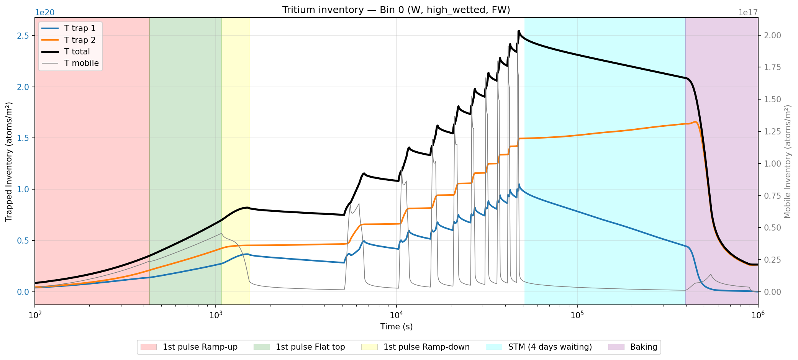

# Example: ITER PFCs tritium retention simulation

This folder recreates the bin definitions and operational scenarios shown in the
paper below. It demonstrates how to:

1. Define the plasma-facing component segments (bins) of a reactor with their
   geometry, materials, and trap parameters.
2. Run HISP on a single bin to solve the hydrogen isotope transport equations
   (diffusion + trapping) via FESTIM and obtain time-resolved retention results.

Reference:
> Dunnell, K., Lleal, A., Hodille, E. A., Dufour, J., Delaporte-Mathurin, R., & Wauters, T. (2026).
> *Hydrogen Inventory Simulations for PFCs (HISP)*.
> arXiv:2604.04751. https://arxiv.org/abs/2604.04751

## Files

| File | Purpose |
|------|---------|
| `make_iter_bins.py` | Creates 94 Bin objects (62 poloidal segments × wetted modes) based on the configuration described in the HISP paper |
| `scenarioA.py` | Defines a plasma operation scenario consisting of: 10 FP,DT pulses + STM (4-day wait) + bake |
| `scenarioB.py` | Defines a plasma operation scenario consisting of: 10 FP,DT pulses + 2-day GDC + bake |
| `scenarioC.py` | Defines a plasma operation scenario consisting of: 5 FP,DT pulses + 1 DD pulse + 5 FP,DT pulses + 1 DD pulse + 2-day GDC + bake |
| `run_single_bin.py` | Main script — runs one bin with a chosen scenario |
| `plot_T_inventory.py` | Plots tritium inventory from results JSON |
| `data/` | Binned plasma flux data (ion/atom fluxes, energies, heat loads per bin) |

## How to run

Activate the PFC-TT conda environment (which should already have `PFC_TT_PATH` set — see the main HISP README for setup).

```bash
conda activate PFC-TT
cd hisp/example
python run_single_bin.py --bin-index 0 --scenario scenarioA
```

Options:
- `--bin-index N` — which bin to simulate (0–93)
- `--scenario {do_nothing, capability_test, just_glow}`

Results are saved as JSON in `results_binN_<material>_<mode>/`.

## Post-processing

`plot_T_inventory.py` reads the results JSON and plots the total tritium
inventory over time, decomposed into its mobile and trapped contributions
(one curve per trap). This gives a clear view of how retention evolves
through the pulse sequence and the baking.

Below is the result for bin 0 — the high-wetted sub-bin of ITER's First Wall
Panel 1 — run with Scenario A:



## Adapting this example for your own simulation

The files in this folder can be used as templates for custom simulations. For any simulation you set up yourself, you need to provide two things: **bin definitions** (geometry, materials, trap parameters) and **binned plasma data files** (fluxes, heat loads, particle energies per bin).

**To define your own bins and materials**, edit `make_iter_bins.py`. The file has two parts:

- **Materials** — defined at the top as `Material` objects. Each material requires a name, atomic density (`Mat_density`), diffusion parameters (`D0`, `E_D`), recombination parameters (`K_R`, `E_R`), and a list of `Trap` objects with their density (atomic fraction), trapping and detrapping rate prefactors (`k_0`, `p_0`) and activation energies (`E_k`, `E_p`). Add or modify materials here to match your reactor's PFC materials.

- **Bin table** (`_BIN_DATA`) — each row defines one bin with its poloidal coordinates (`z_start`, `r_start`, `z_end`, `r_end`), material name, thickness, copper backing thickness, wetted mode, surface areas, and boundary condition types. Modify the rows to match your reactor geometry, or add new rows for additional bins. Each bin must reference a material defined in the materials block above.

**To provide your own plasma data**, you need to supply binned flux data files for each pulse type in your scenario — containing ion and atom fluxes, particle energies, and heat loads for each bin. The `data/` folder contains the files used in this example and serves as a reference for the expected format. These files are assigned to each pulse type inside the scenario file — look for the data file path assignments at the top of `scenarioA.py` as a template. Every bin defined in `make_iter_bins.py` must have a corresponding entry in the binned flux data files.